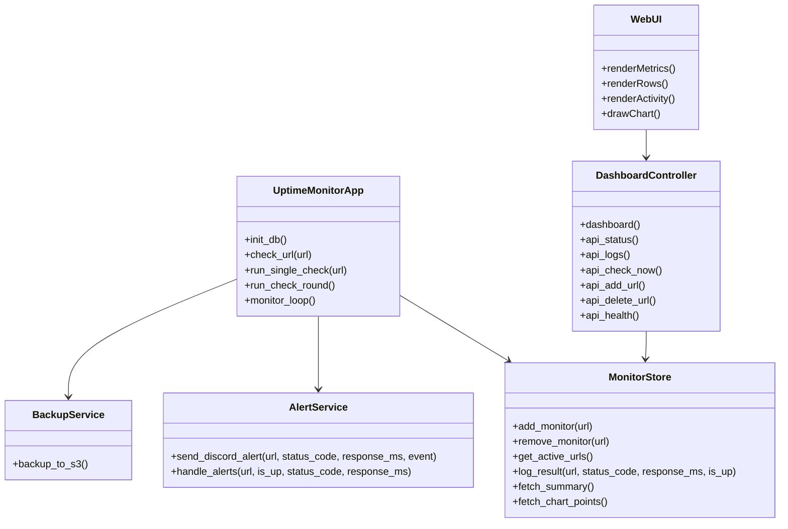

# Cloud Uptime Monitor V2

## Project Overview
Cloud Uptime Monitor V2 is a web-based monitoring application built with Python and Flask. It continuously checks websites, records their availability and response time, and displays the results in a live dashboard.

## Key Features
- Monitors multiple URLs continuously
- Stores monitoring history in SQLite
- Displays uptime, response time, and recent activity in a browser dashboard
- Supports adding and removing monitors from the UI
- Sends Discord alerts when a site goes down or recovers
- Supports backup to Amazon S3
- Can be deployed on AWS EC2

## Main Components
- Backend logic: Python Flask app
- Database: SQLite
- Frontend: HTML, CSS, JavaScript
- Alerts: Discord webhook integration
- Deployment: Docker and AWS

## Architecture Summary
User -> Browser -> Flask App -> URL Checks -> SQLite Database
                                      -> Discord Alerts
                                      -> S3 Backup

## Tech Stack
- Python
- Flask
- SQLite
- HTML/CSS/JavaScript
- Docker
- Discord Webhooks
- AWS EC2 and S3

## Class Diagram

## Project Files
- monitor.py: Core monitoring logic
- templates/index.html: Dashboard page
- static/app.js: Frontend interactions
- static/styles.css: Styling
- README.md: Project documentation

## Short Summary
This project is an uptime monitoring dashboard that keeps checking websites, stores their health status, displays the results in a web interface, alerts on downtime, and supports AWS-based deployment and backup.
